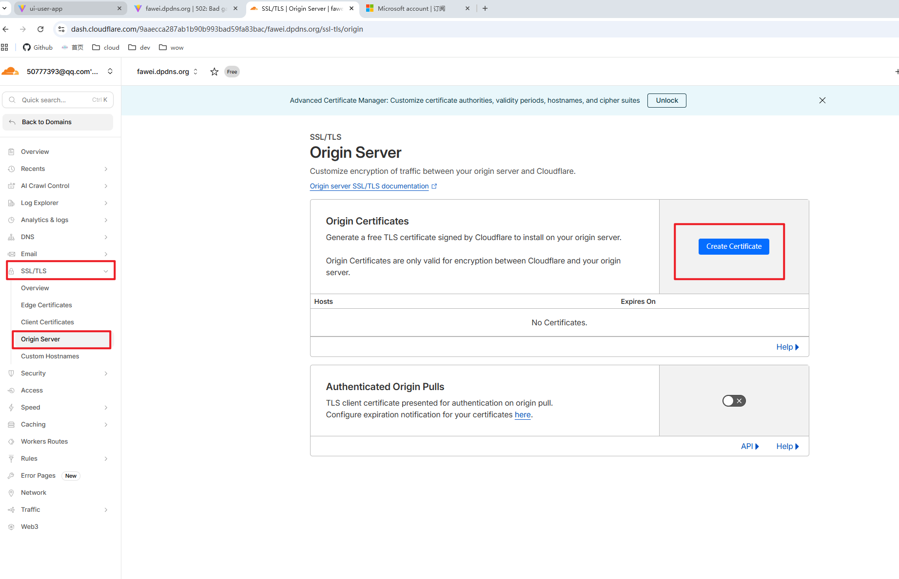
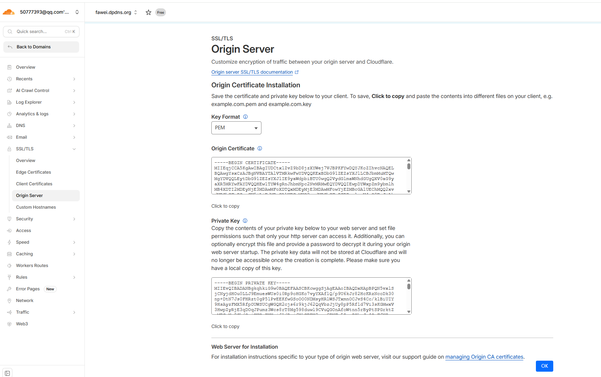
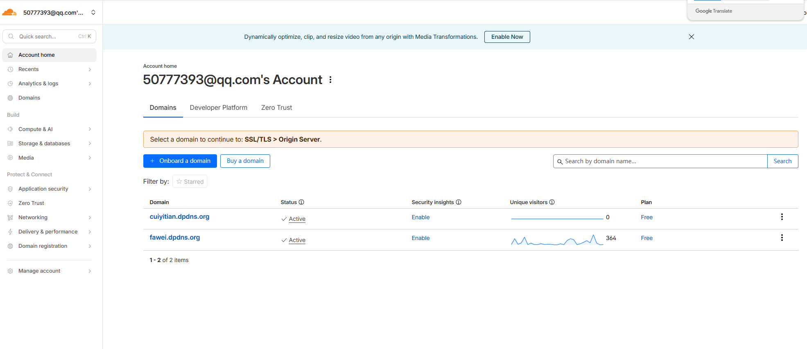

# cloudflare onboarding

## Cert





-[origin-cert-wiki](https://developers.cloudflare.com/ssl/origin-configuration/origin-ca/)

- install cloudflare root cert
  [root cert](https://developers.cloudflare.com/ssl/origin-configuration/origin-ca/#cloudflare-origin-ca-root-certificate)

- Go to origin server
  

- Install Origin CA certificate on origin server

-[nginx-cert](https://knowledge.digicert.com/tutorials/how-to-create-a-csr-using-openssl-and-install-your-ssl-certificate-on-a-nginx-server)

## config cloudflare origin cert in nginx

1. Create ssl folder under nginx main path (or anyother path in your pc)
2. gitignore ssl folder (don't upload private key)
3. update nginx cert configuration

```
  ssl_certificate      ../ssl/origin-cert.pem;
  ssl_certificate_key  ../ssl/cloudflare-origincert-private.pem;
```
